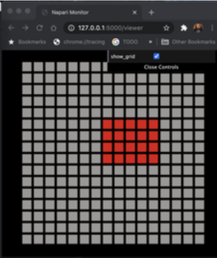

# webmon

Webmon is three things combined:
1. Experimental napari shared memory client.
2. A proof of concept [Flask-SocketIO](https://flask-socketio.readthedocs.io/en/latest/) webserver.
3. An example web app that contains two pages:
    * `/viewer` a three.js (WebGL) display of what tiles are visible in napari.
    * `/loader` with two very simple [Vega-Lite](https://vega.github.io/vega-lite/) graphs related to the `ChunkLoader`.

See napari [PR 1909](https://github.com/napari/napari/pull/1909) for details about this repo.

# Python Requirements

* Python 3.9
    * Newest shared memory features were first added in Python 3.8.
    * However but were found using 3.8, where 3.9 works.
* In webmon directory: `pip3 install -r requirements.txt`

# Javascript Requirements

* Install node/npm
    * Not sure of min req but on MacOS I've been using:
    * `node -v` -> `v14.3.0`
    * `npm -v` -> `6.14.4`
* In webmon directory: `make build`

# To modify Javascript files

* Do not edit .js files under `static`.
    * .json files in static are fair game.
* Edit .js files under `js` then build as above.
* If Javascript only change:
   * `make build`
   * Typically hard reload (shift-command-R) in Chrome is enough.
   * Typically do not need to restart napari/webmon unless you changed those.

# Screenshot

# Originally Based On
* [FlaskTest](https://github.com/ageller/FlaskTest)
    * A simple demo that combines Flask, Socket-IO, and three.js/WebGL

# Python Shared Memory

* [multiprocessing.shared_memory](https://docs.python.org/3/library/multiprocessing.shared_memory.html) (official docs)
* [Python Shared Memory in Multiprocessing](https://mingze-gao.com/posts/python-shared-memory-in-multiprocessing/) (`numpy recarray`)
* [Interview With Davin Potts](https://www.vertica.com/blog/one-on-one-davin-potts-3-news-for-upcoming-python-release-3-8/) (core contributor)

